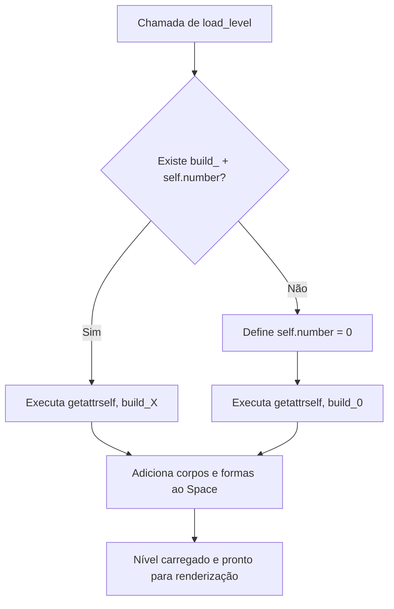

# Documentação Técnica - [level.py](file:///Users/vkfalcioni/Documents/teste%20gustavo/angry-birds-python-game/src/level.py)

O arquivo [level.py](file:///Users/vkfalcioni/Documents/teste%20gustavo/angry-birds-python-game/src/level.py) é o componente responsável por gerenciar a física, a estrutura, as pontuações e o carregamento dinâmico dos níveis do jogo Angry Birds Clone em Python. Ele interage diretamente com a biblioteca de física 2D **Pymunk** e com os elementos do jogo definidos em [characters.py](file:///Users/vkfalcioni/Documents/teste%20gustavo/angry-birds-python-game/src/characters.py) e [polygon.py](file:///Users/vkfalcioni/Documents/teste%20gustavo/angry-birds-python-game/src/polygon.py).

---

## 1. Visão Geral da Classe `Level`

A classe `Level` gerencia o estado e a configuração das fases do jogo. Ela armazena referências para as listas globais de porcos, colunas e vigas presentes no loop principal ([main.py](file:///Users/vkfalcioni/Documents/teste%20gustavo/angry-birds-python-game/src/main.py)) e expõe métodos para carregar cada fase de forma modular.

### Atributos da Classe

| Atributo | Tipo | Descrição |
| :--- | :--- | :--- |
| `self.pigs` | `list` | Lista de instâncias de `Pig` ativas no nível atual. |
| `self.columns` | `list` | Lista de instâncias de `Polygon` (modo coluna) ativas. |
| `self.beams` | `list` | Lista de instâncias de `Polygon` (modo viga) ativas. |
| `self.space` | `pm.Space` | O espaço físico do Pymunk onde corpos rígidos e formas são adicionados. |
| `self.number` | `int` | O número identificador do nível atual (ex: `0` para o nível inicial). |
| `self.number_of_birds` | `int` | Quantidade de pássaros disponíveis para o jogador no nível. |
| `self.one_star` | `int` | Pontuação mínima para conseguir 1 estrela. |
| `self.two_star` | `int` | Pontuação mínima para conseguir 2 estrelas. |
| `self.three_star` | `int` | Pontuação mínima para conseguir 3 estrelas. |
| `self.bool_space` | `bool` | Flag para indicar se o nível se passa no espaço (gravidade zero). |

---

## 2. Métodos de Configuração e Utilitários

### `__init__(self, pigs, columns, beams, space)`
Inicializa uma nova fase com listas vazias e define os parâmetros de estrela padrões.
```python
def __init__(self, pigs, columns, beams, space):
    self.pigs = pigs
    self.columns = columns
    self.beams = beams
    self.space = space
    self.number = 0
    self.number_of_birds = NORMAL_BIRD_COUNT
    self.one_star = 30000
    self.two_star = 40000
    self.three_star = 60000
    self.bool_space = False
```

### `finalize_level_setup(self)`
Define a quantidade padrão de pássaros com base no ambiente (espaço vs. normal) e reinicia os limites das estrelas.
```python
def finalize_level_setup(self):
    self.number_of_birds = SPACE_BIRD_COUNT if self.bool_space else NORMAL_BIRD_COUNT
    self.one_star = 30000
    self.two_star = 40000
    self.three_star = 60000
```

---

## 3. Helpers de Geração de Estruturas Físicas

Para facilitar a construção dos níveis, a classe oferece métodos geradores para criar padrões geométricos e estruturas físicas recorrentes no cenário.

### `open_flat(self, x, y, n)`
Cria uma estrutura aberta e empilhável, composta por duas colunas verticais e uma viga horizontal no topo.
* **x**: Posição horizontal base da coluna esquerda.
* **y**: Posição vertical inicial do solo.
* **n**: Número de andares/repetições verticais da estrutura.

### `closed_flat(self, x, y, n)`
Cria uma estrutura fechada composta por duas colunas verticais, uma viga na base e uma viga no topo, gerando uma sala ou compartimento fechado estável.
* **x**: Posição horizontal base.
* **y**: Posição vertical inicial do solo.
* **n**: Número de andares/salas empilhadas verticalmente.

### `horizontal_pile(self, x, y, n)`
Cria uma pilha horizontal de vigas de madeira (`Polygon` com dimensões `85x20`).
* **n**: Número de vigas empilhadas verticalmente de forma compactada.

### `vertical_pile(self, x, y, n)`
Cria uma pilha vertical de colunas de madeira (`Polygon` com dimensões `20x85`).
* **n**: Número de colunas empilhadas uma em cima da outra de forma compactada.

---

## 4. Definição dos Níveis (`build_X`)

Cada fase é definida por um método do tipo `build_<número>`. Esses métodos adicionam instâncias de porcos (`Pig`) e blocos de madeira (`Polygon`) usando coordenadas absolutas e os helpers de estrutura física.

### Níveis Padrões (0 a 11)
* **Nível 0**: Uma estrutura simples de dois andares com dois porcos de vida baixa (`life = 5`).
* **Níveis 1 a 3**: Estruturas de nível fácil a intermediário com foco no aprendizado de colisão.
* **Nível 4**: Primeira fase no espaço (`self.bool_space = True`), ativando a mecânica de gravidade reduzida/zero e dando mais pássaros (`SPACE_BIRD_COUNT = 8`).
* **Níveis 5 a 11**: Progressão da complexidade das pilhas e número de inimigos.

### Nível Adicional: Nível 12 (`build_12`) - Castle Fortress
Nível customizado adicionado para testes e demonstrações de estruturas físicas complexas com alto grau de estabilidade.
```python
def build_12(self):
    """level 12 - Castle Fortress"""
    # 4 porcos normais posicionados estrategicamente nas duas torres
    pig1 = Pig(830, 100, self.space)
    pig1.life = 25
    self.pigs.append(pig1)
    
    pig2 = Pig(830, 225, self.space)
    pig2.life = 25
    self.pigs.append(pig2)
    
    pig3 = Pig(1030, 100, self.space)
    pig3.life = 25
    self.pigs.append(pig3)
    
    pig4 = Pig(1030, 225, self.space)
    pig4.life = 25
    self.pigs.append(pig4)
    
    # 1 Boss Pig central altamente resistente
    boss_pig = Pig(930, 324, self.space)
    boss_pig.life = 60
    self.pigs.append(boss_pig)
    
    # Torres laterais fechadas
    self.closed_flat(800, 0, 2)
    self.closed_flat(1000, 0, 2)
    
    # Plataforma central sustentadora
    self.horizontal_pile(900, 0, 3)
    self.vertical_pile(900, 67.5, 2)
    self.vertical_pile(950, 67.5, 2)
    
    # Ponte superior
    p_bridge = (930, 300)
    self.beams.append(Polygon(p_bridge, 85, 20, self.space))
    
    # Pilares externos de proteção
    self.vertical_pile(710, 7.5, 2)
    self.vertical_pile(1130, 7.5, 2)
    
    self.finalize_level_setup()
```

---

## 5. Mecanismo de Carregamento Dinâmico (`load_level`)

O carregamento das fases utiliza reflexão em Python (`getattr`) para chamar dinamicamente o método correspondente à fase atual armazenada no atributo `self.number`.

```python
def load_level(self):
    try:
        build_name = "build_" + str(self.number)
        getattr(self, build_name)()
    except AttributeError:
        # Se a fase não existir (ex: passou da última fase), o jogo retorna ao Nível 0
        self.number = 0
        build_name = "build_" + str(self.number)
        getattr(self, build_name)()
```

### Fluxo de Carregamento de Fase:

